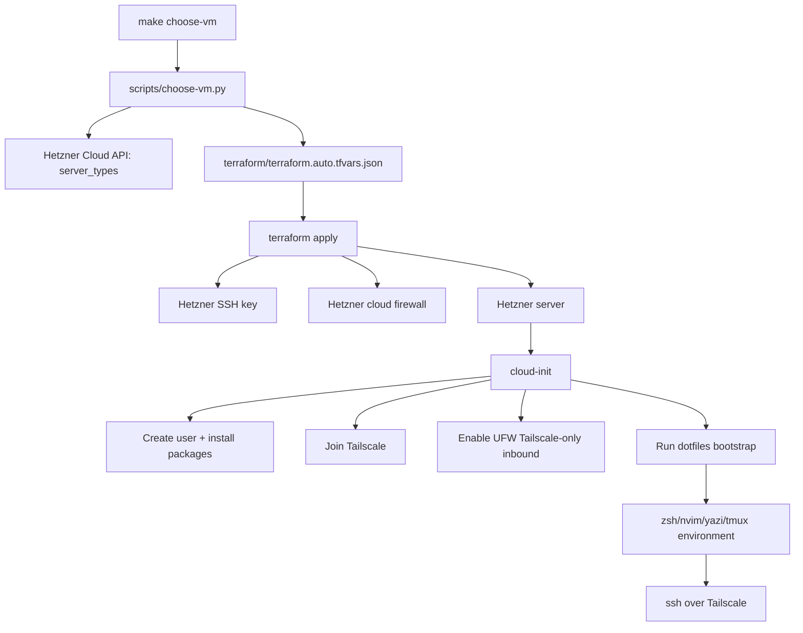

# Hetzner Devbox Automation Plan

Source conversation: <https://chatgpt.com/share/6a48aab8-7938-83ee-8810-1c0b94513742>

## Goal

Automate creation of a repeatable Hetzner Cloud VM that is ready for SSH-over-Tailscale and has the same shell/editor/file-management environment currently configured by hand.

The target end state is:

```bash
make devbox
ssh myuser@devbox
```

The VM should come up with:

- a selected Hetzner server type and location based on cost, capacity, and user limits;
- no public inbound access during normal operation;
- Tailscale joined automatically;
- UFW hardened for Tailscale-only inbound access;
- a non-root sudo user with the configured SSH public key;
- zsh, Oh My Zsh, Powerlevel10k, fzf/autocomplete, yazi, Neovim + lazy.nvim + yazi.nvim, tmux, and tmuxp installed from repeatable config.

## Current manual workflow being replaced

Today the setup is manual:

1. Check which Hetzner tier/location is available.
2. Pick the cheapest suitable VM within a personal min/max cost limit.
3. Buy the server.
4. SSH as `root` using the Mac SSH private key whose public key is already in Hetzner.
5. Run bootstrap commands:
   - `apt update`
   - install `vim`
   - install `ufw`
   - install Tailscale
   - install `python3-pip`
   - set UFW defaults: deny incoming, allow outgoing, allow Tailscale inbound
   - create personal user and password
   - add user to `sudo`
   - copy `authorized_keys` into the user home and `chown` it
   - install `zsh` and set it as the user shell
   - install Oh My Zsh
   - install Powerlevel10k and manually configure aesthetics
   - install autocomplete and `fzf`
   - install `yazi`
   - install Neovim, `lazy.nvim`, and `yazi.nvim`
   - install `tmux` and `tmuxp`

## Core design decision

Do not make Terraform SSH into the VM and run the 15 manual commands.

Use this split instead:

| Layer | Owns | Does not own |
|---|---|---|
| Terraform | Hetzner infrastructure: server, SSH key, firewall, labels, outputs | arbitrary remote shell provisioning |
| VM selector script | Choosing server type/location before `terraform apply` | changing infrastructure directly |
| cloud-init | First-boot OS bootstrap: packages, user, SSH key, Tailscale install, UFW baseline | long-term dotfile maintenance |
| dotfiles/bootstrap script | zsh, Oh My Zsh, Powerlevel10k, fzf/autocomplete, Neovim config, yazi config, tmux/tmuxp config | cloud resources |
| Ansible, later if needed | Idempotent reconfiguration after the VM exists | first-version requirement |
| Packer/snapshots, later if needed | Faster pre-baked base image | first-version requirement |

Reason: Terraform provisioners are supported but should be a last resort. HashiCorp recommends provider-native boot-time mechanisms such as `user_data`, cloud-init, images, or configuration-management tools before using provisioners.

## Planned v1 architecture



## Repository layout to build toward

```text
myvmkit/
  PLAN.md
  Makefile
  terraform/
    main.tf
    variables.tf
    outputs.tf
    versions.tf
    cloud-init.yaml.tftpl
    terraform.tfvars.example
  scripts/
    choose-vm.py
    create-tailscale-auth-key.sh   # optional later; only if using API-based key minting
  dotfiles/
    bootstrap.sh
    zsh/
      .zshrc
      .p10k.zsh
    nvim/
      init.lua
      lua/
    tmuxp/
      nvim-omp-term.yaml
```

The current repository only has `.tmuxp.yaml`, so `PLAN.md` starts the documentation convention at the repo root.

## Terraform responsibilities

Terraform will create and track Hetzner Cloud resources only.

Planned Terraform resources:

- `hcloud_ssh_key`
  - Adds the Mac public key to Hetzner.
  - Uses `file(var.ssh_public_key_path)`.
  - Never reads or stores the private key.
- `hcloud_firewall`
  - Normal mode: no public inbound rules.
  - Allows outbound traffic so `apt`, Tailscale, Git, and package installers can work.
  - Optional temporary break-glass SSH rule limited to the current public IP during debugging.
- `hcloud_server`
  - Uses selected `server_type` and `location` variables.
  - Uses Ubuntu 24.04 unless there is a later reason to choose another image.
  - Attaches the SSH key and firewall.
  - Passes rendered cloud-init through `user_data`.
  - Adds labels such as `role=devbox` and `owner=<username>`.
- Outputs
  - server name
  - public IPv4/IPv6, mostly for debugging
  - Tailscale hostname/MagicDNS name if known or derivable

Terraform will not:

- run `remote-exec` for the bootstrap;
- store the SSH private key;
- store plaintext Linux passwords;
- make nondeterministic server choices during every `terraform apply`.

## Server type and location selection

The manual cheapest-available selection becomes a pre-Terraform script.

Planned script: `scripts/choose-vm.py`

Inputs:

- minimum vCPU count;
- minimum RAM in GB;
- maximum monthly EUR price;
- allowed locations, for example `fsn1,nbg1,hel1`;
- preferred architecture, for example `x86` or `arm`;
- optional preferred server families;
- optional preferred locations order.

Behavior:

1. Query Hetzner Cloud `GET /server_types`.
2. Read each server type's prices and per-location metadata.
3. Filter candidates by:
   - vCPU minimum;
   - RAM minimum;
   - max monthly price;
   - allowed architecture;
   - allowed locations;
   - `locations[].available == true`;
   - no active deprecation marker where possible.
4. Prefer `locations[].recommended == true` when multiple locations match.
5. Sort by monthly cost first, then preferred location/family.
6. Print the selected VM and why it was chosen.
7. Write `terraform/terraform.auto.tfvars.json`.

Example generated file:

```json
{
  "server_type": "cx23",
  "location": "fsn1",
  "name": "devbox-2026-07-04"
}
```

Reason for a separate selector: Hetzner availability can change, and availability is an indicator rather than a provisioning guarantee. Writing `terraform.auto.tfvars.json` makes the Terraform plan deterministic and reviewable before creation.

## cloud-init responsibilities

cloud-init will handle first boot.

Planned `cloud-init.yaml.tftpl` behavior:

- run package update/upgrade;
- install base packages:
  - `vim`
  - `ufw`
  - `curl`
  - `git`
  - `zsh`
  - `python3-pip`
  - `tmux`
  - `fzf`
  - `unzip`
  - `ripgrep`
  - prerequisites for Neovim/yazi installation as needed
- create the personal user;
- add the user to `sudo`;
- set `/usr/bin/zsh` as the user's shell;
- install the SSH public key directly into that user's `authorized_keys`;
- lock password login by default rather than storing a plaintext password;
- install Tailscale;
- join Tailscale using a one-off or ephemeral auth key;
- configure UFW:
  - default deny incoming;
  - default allow outgoing;
  - allow inbound on `tailscale0`;
  - enable UFW non-interactively;
- run the dotfiles bootstrap script as the personal user.

The current manual copy from root's `authorized_keys` is intentionally removed. cloud-init can install the configured key directly for the created user.

## Tailscale plan

Use Tailscale as the normal SSH path.

Planned behavior:

- VM joins the tailnet during cloud-init.
- Public SSH is not required for normal access.
- SSH command uses the Tailscale IP or MagicDNS hostname.
- Tailscale ACLs/grants remain the real access-control layer inside the tailnet.

Auth key policy:

- Prefer one-off, pre-authorized auth keys for regular devbox creation.
- Prefer ephemeral auth keys for disposable throwaway VMs.
- Avoid reusable auth keys unless a secret manager is introduced.
- Treat any auth key passed to cloud-init/Terraform as sensitive.
- Assume Terraform state may contain rendered `user_data`; protect state accordingly.

Later improvement: mint short-lived tagged Tailscale auth keys at creation time, using Tailscale OAuth/API automation, instead of manually supplying a key.

## Firewall plan

Use both Hetzner Cloud Firewall and UFW.

Hetzner Cloud Firewall:

- blocks public inbound traffic before packets reach the VM;
- normally has no public inbound SSH rule;
- allows outbound TCP/UDP for package installation and Tailscale connectivity;
- may include temporary SSH-from-current-IP for break-glass debugging only.

UFW inside the VM:

```bash
ufw default deny incoming
ufw default allow outgoing
ufw allow in on tailscale0
ufw --force enable
```

This follows the Tailscale hardening shape: deny public inbound, allow outbound, and allow inbound traffic on the Tailscale interface.

## Dotfiles and development environment

Steps 10-15 from the manual process become code in `dotfiles/`.

Planned bootstrap behavior:

- install Oh My Zsh non-interactively;
- install Powerlevel10k;
- commit `.p10k.zsh` so the aesthetics are repeatable instead of manually configured;
- install zsh autocomplete/suggestions/highlighting plugins;
- configure `fzf`;
- install/configure Neovim;
- install `lazy.nvim`;
- configure `yazi.nvim` from the Neovim config, for example `dotfiles/nvim/lua/yazi.lua`;
- install yazi, using default yazi config unless custom yazi behavior is needed later;
- install/apply tmux config;
- add tmuxp session files only if we want named, reusable tmuxp layouts beyond a single `.tmuxp.yaml`.

The bootstrap script must be safe to re-run. If it is not fully idempotent on day one, it should at least skip already-installed directories/files and fail loudly instead of duplicating config.

## Makefile workflow

Planned commands:

```bash
make choose-vm MIN_RAM=4 MAX_EUR=8 LOCATIONS=fsn1,nbg1,hel1
make plan
make apply
make ssh
make destroy
```

Later convenience target:

```bash
make devbox
```

Expected `make devbox` sequence:

1. run `choose-vm.py`;
2. show selected server type/location/cost;
3. run `terraform init` if needed;
4. run `terraform apply`;
5. wait for cloud-init/Tailscale readiness if we add a readiness check;
6. print the SSH command.

## Secrets and state handling

Sensitive values:

- `HCLOUD_TOKEN`;
- Tailscale auth key or OAuth credentials;
- rendered cloud-init if it includes secrets;
- Terraform state.

Rules:

- Store tokens in environment variables, not committed files.
- Do not commit `terraform.tfvars`, `terraform.auto.tfvars.json`, `.terraform/`, or `terraform.tfstate`.
- Commit only `terraform.tfvars.example` with placeholders.
- Never put the Mac SSH private key in Terraform.
- Avoid Linux password authentication. Use SSH keys. If password auth becomes required, use a hashed password only and keep it out of committed files.
- Treat local Terraform state as plaintext sensitive data unless/until a secure remote backend is added.

## Implementation phases

### Phase 1: Minimal repeatable VM

Deliverables:

- Terraform provider setup for Hetzner Cloud.
- Variables for name, username, SSH public key path, server type, location, and Tailscale auth key handling.
- Hetzner SSH key resource.
- Hetzner firewall resource.
- Hetzner server resource with `user_data` from cloud-init.
- cloud-init creates user, installs base packages, installs Tailscale, configures UFW.
- Outputs for connection details.
- `.gitignore` entries for Terraform state and generated tfvars.
- `terraform.tfvars.example`.

Acceptance checks:

- `terraform fmt -check` passes.
- `terraform validate` passes.
- `cloud-init.yaml.tftpl` renders with example variables.
- New VM can be reached over Tailscale SSH as the personal user.
- Public inbound SSH is not open in normal mode.

### Phase 2: VM selector

Deliverables:

- `scripts/choose-vm.py` queries Hetzner server types.
- Filters by min RAM, min CPU, max price, architecture, allowed locations, availability, and deprecation.
- Writes `terraform/terraform.auto.tfvars.json`.
- Prints selected type/location/price/reason.
- Handles no-match cases with a clear error.

Acceptance checks:

- Script can run in dry-run mode without writing files.
- Script output is deterministic for a saved fixture response.
- Generated `terraform.auto.tfvars.json` is valid JSON.

### Phase 3: Dotfiles bootstrap

Deliverables:

- `dotfiles/bootstrap.sh`.
- zsh config.
- `.p10k.zsh` committed.
- Neovim lazy config.
- Neovim yazi plugin config, for example `dotfiles/nvim/lua/yazi.lua`.
- tmux config, plus `dotfiles/tmuxp/nvim-omp-term.yaml` for the nvim/omp/terminal layout.
- cloud-init invokes bootstrap as the personal user.

Acceptance checks:

- Bootstrap can run on a fresh Ubuntu VM.
- Re-running bootstrap does not duplicate plugin installs or corrupt config.
- New login shell is zsh.
- `nvim`, `yazi`, `tmux`, and `tmuxp` are available for the personal user.

### Phase 4: Makefile and operator workflow

Deliverables:

- `make choose-vm`.
- `make plan`.
- `make apply`.
- `make ssh`.
- `make destroy`.
- Optional `make devbox` wrapper.

Acceptance checks:

- A new machine can be selected, created, joined to Tailscale, and reached through the documented commands.
- Destroy removes the Hetzner server.
- The docs match the commands.

### Phase 5: Later hardening and speedups

Not required for v1, but planned options:

- Add Ansible for post-create idempotent reconfiguration.
- Add Packer or Hetzner snapshots to reduce bootstrapping time.
- Add Tailscale OAuth/API-based short-lived auth key minting.
- Add a secure remote Terraform backend if this is used from multiple machines.
- Add cloud-init completion polling and structured health checks.

## Non-goals for v1

- No Terraform `remote-exec` bootstrap.
- No public inbound SSH by default.
- No plaintext Linux password in Terraform or cloud-init.
- No reusable long-lived Tailscale auth key unless explicitly accepted later.
- No Packer image baking until boot time becomes a real problem.
- No Ansible until post-create drift management is needed.

## External references checked while writing this plan

- Terraform provisioners guidance: <https://developer.hashicorp.com/terraform/language/resources/provisioners/syntax>
- Hetzner Cloud API reference: <https://docs.hetzner.cloud/reference/cloud>
- Hetzner Cloud locations: <https://docs.hetzner.com/cloud/general/locations/>
- cloud-init SSH examples: <https://docs.cloud-init.io/en/latest/reference/yaml_examples/ssh.html>
- cloud-init examples: <https://docs.cloud-init.io/en/latest/reference/examples.html>
- Tailscale UFW hardening guide: <https://tailscale.com/docs/how-to/secure-ubuntu-server-with-ufw>
